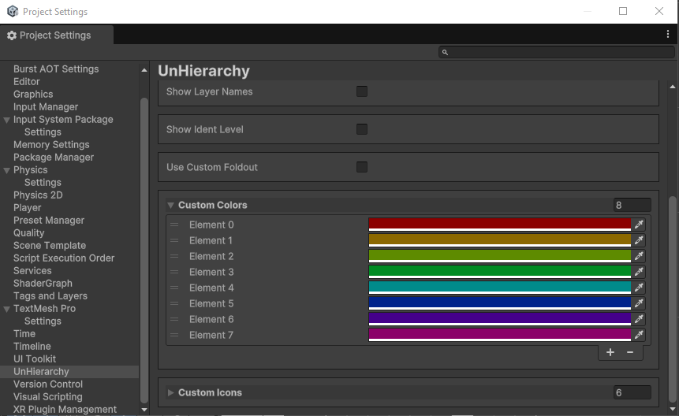

# UnHierarchy

The unity package to customize the hierarchy to your hearts content!

This package is meant to be a **free, public source**, unity package to customize the boring, default unity hierarchy. It is also meant to be a **resource to help others to make their own hierarchy customizations**, given that it takes some work to mess with Unity's current Hierarchy callbacks, and the lack of documentation and examples doesn't help.

## Table of Contents
1. [Object Customization](#object-customization)
   1. [Attribute Customization](#attribute-customization)
   2. [Specific Object Customization](#specific-object-customization)
2. [Settings](#settings)
   1. [Selection Color](#selection-color)
   2. [Alternating Background](#alternating-backgrounds)
   3. [Custom Background Sprite](#custom-background-sprite)
   4. [Automatic Icons](#automatic-icons)
   5. [Layer Names](#layer-names)
   6. [Indentation Marks](#indentation-marks)
   7. [Custom Foldouts](#custom-foldouts)
   8. [Custom Colors](#custom-colors)
   9. [Custom Icons](#custom-icons)
3. [Inner Workings](#inner-workings)
4. [Expanding & Contributing](#expanding--contributing)

## Object Customization
This package includes a couple ways to customize specific object's background and icons in the hierarchy.

### Attribute Customization
This package includes two attributes you can use on your MonoBehaviours that allow you to customize the background and icon of gameobjects that use them.
Due to the way attributed work, the icon can only be one of Unity's builtin icons. For a list of Unity builtin icons go [here](https://github.com/halak/unity-editor-icons/tree/master).

| Code | Result |
| ------------- | ------------- |
|   |   |

### Specific Object Customization
The other way to customize objects is to customize their instances separately. To do this, simply hover a game object and press `Alt + LMB` and a popup will appear that allows you to customize the objects background to any color and the icon to any icon you have configured. This is the most versatile way of customization.

The preconfigured colors and the configured icons can be found in the project settings section of UnHierarchy. Icons can be builtin and custom images, just use the dropdown button to switch between both options!
> [!NOTE]
> Specific Object Customizations are serialized in the settings scriptable object. So they are kept between sessions and between scenes.

> [!CAUTION]
> Removing the scriptable object containing the settings WILL reset them and all of your specific configurations.

| Change Color | Change Icon |
| ------------- | ------------- |
|   |   |

## Settings
There are a couple of settings included in this package to change the way the default Unity hierarchy is renderer. These can be toggled individually of toghether.

These settings are stored in a scriptable object in the path `Assets/Editor/` and have a project settings section:

### Selection Color
You can change the color of your hierarchy selection to any color you want.
> [!TIP]
> Its highly recommended to use somewhat transparent colors for selection, as opaque colors can be a bit harsh or confusing on the hierarchy.

| Default Color  | Example Color |
| ------------- | ------------- |
|   |   |

### Alternating Backgrounds
Using alternating background makes it easy to distinguish long hierarchy lines. The color can also be customized at will, you do you.

| Unity Default | Alternating Background |
| ------------- | ------------- |
|   |   |

### Custom Background Sprite
This setting is used to configure the background sprite of the customizations done to the objects.

| Unity Default | Alternating Background |
| ------------- | ------------- |
|   |   |

### Automatic Icons
Automatic Icons makes it so instead of the default object Icon, a Icon identifying the object. This choice is limited to the logic in the package, and is currently as follows:

1. **If Empty Objects:** Transform Icon
2. **If its an Object with only 1 component:** That 1 components Icon
3. **If Object has only components of the same type:** Those components Icon
4. **If Object has Canvas Render:** Canvas Render Icon
5. **If Object has Camera:** Camera Icon

| Unity Default | Automatic Icons |
| ------------- | ------------- |
|   |   |

### Layer Names
With Layer Names you can render the objects layer names right on the hierarchy.

| Unity Default | Automatic Icons |
| ------------- | ------------- |
|   |   |

### Indentation Marks
You can turn on Indentation marks to draw some lines to show nested objects. The color of the lines can be customized.

| Unity Default | Automatic Icons |
| ------------- | ------------- |
|   |   |

### Custom Foldouts
With this toggle you can customize the look of the foldouts in the hierarchy. By default the alternate foldouts are a `'plus'` and `'minus'` icon, but you can change them to whatever you want.
> [!CAUTION]
> Due to the size of foldouts and the way background work, it is advised that the images you choose to use for foldouts be no bigger than 11px by 11px.

| Unity Default | Automatic Icons |
| ------------- | ------------- |
|   |   |

### Custom Colors
These are the colors that appear on the customization popup, you can customize them, reorder them, remove them, whatever you decide to do.

| Popup | Default Colors |
| ------------- | ------------- |
|   |   |

### Custom Icons
These are the icons that appear in the customization popup. These can be builtin icons, or you can even include custom images! For a list of Unity builtin icons go [here](https://github.com/halak/unity-editor-icons/tree/master).

| Popup | Default Colors |
| ------------- | ------------- |
|   |   |

To include custom images use the dropdown button on each icon entry in the custom icons to swap the icon to use a custom image:

## Inner Workings
Curious as to how this is working? Well let me tell you. Unity by default exposes a callback to expand the Unity Hierarchy called [hierarchyWindowItemOnGUI](https://docs.unity3d.com/ScriptReference/EditorApplication-hierarchyWindowItemOnGUI.html). This callback runs for every line in the hierarchy, after its contents have already been drawn, and only recieves as parameters the `instanceId` of the game object of the line and the `rect` of the line, from the icon to the end of the text.

This isn't alot of modularity, and given the way IMGUI works, we are only able to draw on top of the original content, making things like changing icons or adding custom line backgrounds.

Therefore for us to be able to make changes like the ones present on this package, we need to make our own hierarchy from the ground up! That's right! Redraw _the whole hierarchy again_ on top of the original one! This way we have control over where we can draw backgrounds, over which icons show up, everything! This is how this package works and it was the only way I found to make background and custom icons work with the tools given. Although if you know something I do not, do tell me, making this better is always a plus!

## Known Issues
1. Visibility Icons sometimes disappear when moving the mouse slowly downwards
2. Visibility Icons appear when hovering the mouse over project settings
3. Objects that are part of a prefab but not a prefab themselves still show the isolation arrow and the prefab icon
4. When a game object only has scripts, if the scripts are of different types, the auto icon wont be that of a script

## Expanding & Contributing
You are free to fork this repo to learn how to make a Unity hierarchy expansion or to use it as a jumping off point to make your own.

If you want to contribute to this package you can always create issues with bugs and enhancements or fork it and make PR's. Although I don't promise that these will be merged or acted upon.